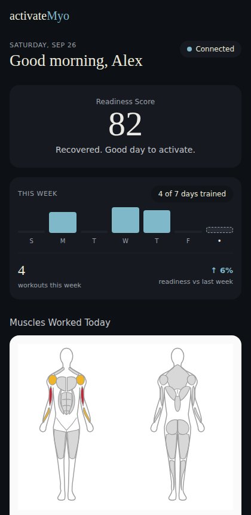

# activateMyo

A real-time muscle activation tracker built around a 2× MyoWare 2.0 EMG sensor rig
(Wireless Shields + SparkFun Thing Plus ESP32) — designed so an athlete and their
personal coach can both see live muscle tension, fatigue, and workout quality in
one clean, Oura-ring-inspired interface.

This repo is the **front-end / design prototype**: a complete, production-shaped
React app running entirely on realistic hardcoded data, so the UI, navigation, and
data model are all locked in ahead of wiring up the actual sensor pipeline.



## Tech stack

- **Vite + React + TypeScript** — app shell and build tooling
- **Tailwind CSS** — styling, using a small set of custom design tokens (see below)
- **React Router (`HashRouter`)** — client-side routing; hash-based specifically so
  the built app can be hosted as static files (e.g. GitHub Pages) with zero server
  routing configuration
- Pure SVG components (body map, activation rings) with no chart/graphics
  dependency, so they port directly to `react-native-svg` if this ever becomes a
  native mobile app

## Getting started

```bash
npm install
npm run dev       # start the dev server
npm run build      # type-check + production build to dist/
npm run preview    # serve the production build locally
```

## Supabase setup

With `VITE_SUPABASE_URL` / `VITE_SUPABASE_ANON_KEY` set, the app requires
**sign-in** (Supabase email/password auth) and shows the signed-in user's own
rows from `profiles`, `coach_links`, `sessions` and `sets`. Without them it
runs in demo mode on the mock data in `src/data/mockData.ts` (no login).

1. **Env vars** — `cp .env.example .env.local` and fill in both values
   (Project Settings → API). Never use the `service_role` key in the
   front-end. On **Vercel**, add the same two under Project → Settings →
   Environment Variables for Production, then **redeploy** (Vite bakes env
   vars in at build time — a build without them silently falls back to demo
   mode).
2. **Read access** — run `supabase/demo_read_access.sql` (read-only policies).
3. **Sign up** — run `supabase/signup_profiles.sql` (safe to re-run). It adds
   `first_name`, `last_name`, `avatar_url`, `email` to `profiles` and a
   trigger that fills a `profiles` row for every new user — from the Sign up
   form, or from Google (name, picture, email). In Supabase → Authentication
   → URL Configuration set **Site URL** to the Vercel URL and add it (plus
   `http://localhost:5173/` for dev) to **Redirect URLs**.
   (With "Confirm email" off under Authentication → Providers → Email, new
   email users are signed in immediately.)
4. **Google sign-in** — in Google Cloud Console → APIs & Services →
   Credentials, create an **OAuth client ID** (type *Web application*) with
   authorized redirect URI
   `https://<project-ref>.supabase.co/auth/v1/callback`. Paste its client ID
   and secret into Supabase → Authentication → Providers → **Google** and
   enable it. No front-end config is needed.
5. **Writing workouts** — run `supabase/write_access.sql` so signed-in users
   can create/edit/delete their own `sessions` and `sets` (and nobody
   else's). The app writes through `src/data/saveSession.ts`; until the EMG
   sensor streams real sets, **Workout → Test tools → Save test session**
   saves a generated workout for the signed-in account and opens it.
6. **Body metrics** — run `supabase/body_metrics.sql`. It adds `birth_date`,
   `weight_updated_at`, `height_updated_at` to `profiles` and lets users
   update only their own height/weight/date of birth (not their role). After
   sign-in, athletes without height, weight or date of birth are sent to
   `/body-metrics` first. Age is computed from the birth date, so it rises
   every birthday. In-app reminders (Today + Profile): weight every 20 days,
   height yearly while under 22 (`src/lib/bodyMetrics.ts`).
7. **Share with Coach** — run `supabase/coach_sharing.sql`. Athletes press
   *Generate share code* on the Coach screen (6 characters, single use, valid
   7 days); a coach account enters it on their Coach screen to link, and can
   switch between their athletes. Either side can remove the link. Codes and
   links are visible only to the people involved; links can only be created
   by redeeming a code (the script replaces every existing `coach_links`
   policy).
8. **Sensor stations (live recording)** — a PC with the MyoWare rig runs
   `python src/station.py` (`EMG/app`, see `EMG/app/README.md`) and is shared:
   a user signs in on their phone, opens **Workout → Show QR code**, and the
   station's webcam scans it; from then on it records into that account
   until they disconnect or log out (10 minutes idle also frees it).
   Setup, once:
   - Run `supabase/stations.sql` (tables `stations`, `connect_codes`,
     `station_commands`; server-only: RLS on, no policies).
   - Vercel → Project → Settings → Environment Variables (Production):
     `SUPABASE_SERVICE_ROLE_KEY` (Supabase → Project Settings → API; **server
     only — never a `VITE_` variable**) and `SUPABASE_URL` (or it falls back
     to `VITE_SUPABASE_URL`).
   - Vercel → Storage / Marketplace → **Upstash for Redis** → create a free
     database and connect it to this project (adds `KV_REST_API_URL` /
     `KV_REST_API_TOKEN`). It carries the live signal for ~15 s; nothing
     there is kept.
   - Redeploy.

   How it fits together (`api/` = Vercel functions, `src/lib/useStation.ts`,
   `src/components/StationRecorder.tsx`):

   ```
   phone ── /api/me/* (Supabase access token) ──► Vercel ── service role ──► Supabase
   station ── /api/station/* (station key) ─────►   │   ◄── live data ──► Upstash (15 s)
   ```

   | Endpoint | Who | What |
   |---|---|---|
   | `POST /api/me/connect-code`, `GET /api/me/connect-status` | phone | one-time QR code (2 min), wait for a scan |
   | `GET /api/me/station`, `POST /api/me/release` | phone | connected station / disconnect (also on Logout) |
   | `POST /api/me/command` | phone | `start` (creates the `sessions` row) · `next_set` · `finish` · `cancel` |
   | `GET /api/me/live?since=` | phone | raw envelope + live metrics |
   | `POST /api/station/register` | station | first run → station id + key |
   | `POST /api/station/heartbeat`, `claim`, `release` | station | sensors online, scanned QR, "end" |
   | `GET /api/station/commands` | station | long-poll mailbox (≤ 8 s) |
   | `POST /api/station/live`, `set`, `finish` | station | live data; sets/summary saved to the **connected** user's session |

   The station sends JSON only; Vercel checks it is recording that session
   for the connected user and writes fixed rows. The session ID and SQL to
   inspect it are shown on the Workout screen.
9. **Test data (optional)** — `supabase/test_data.sql` fills one account
   (set `target_email` at the top) with sessions aimed at each screen: today
   (Today + Session with coach feedback and L/R imbalance), this week
   (week bars, trends), last week (History only), and a session with no
   sets. `supabase/test_data_cleanup.sql` removes them again.
10. **Demo data (optional)** — `supabase/seed_demo.sql` creates two logins,
   `alex@activatemyo.io` (athlete) and `coach@activatemyo.io` (coach), both
   with password `demo-password-123`, plus sessions/sets.

How the tables map onto the UI (`src/data/supabaseData.ts`):

| UI | Source |
|---|---|
| Profile | signed-in user's `profiles` row (first/last name, picture, email); falls back to Google's `user_metadata` |
| Coach | latest `coach_links` row (athletes: `athlete_id` = me; coaches: `coach_id` = me) + coach's `profiles.name` |
| Session / History / This Week / Today | `sessions` + `sets` of the athlete (coaches see their linked athlete) |
| Session body map | `sessions.muscle_map` (`{"f-bicep-l": "primary" \| 0-100, …}`), else the exercise definition |
| Live Workout screen | the connected station (`/api/me/live`); raw signal is never stored |
| Readiness, fatigue | not stored yet — mock data |

Auth lives in `src/auth/` (`AuthProvider`, `RequireAuth`, `useAuth()`); the
Sign in / Sign up screen is `src/pages/Login.tsx` (the first screen when
signed out) and Logout is on the Profile screen.

## Pages

| Route       | Screen                                                          |
|-------------|------------------------------------------------------------------|
| `/`         | Today — readiness score, this week's training, muscles worked, daily metrics |
| `/workout`  | Live set view — L/R activation rings, imbalance, set metrics     |
| `/session`  | Post-set/session summary — muscle map for the exercise, performance metrics, coach feedback |
| `/history`  | Past sessions + weekly trends                                    |
| `/coach`    | Coach share code + access management                              |
| `/profile`  | Athlete profile, body metrics, connected devices                  |

## Architecture: hardcoded data today, real sensor data tomorrow

Nothing in this app was built assuming the data is fake — it was built assuming
the data has a **stable shape**, and today that shape happens to be filled in by
hand. This keeps a very small, well-defined seam for plugging in the real
LibEMG → FastAPI → (Supabase) pipeline later, without touching any component or
page.

```
src/data/types.ts       ← TypeScript interfaces: MuscleMap, Session, DaySummary,
                            AthleteProfile, ReadinessSnapshot, etc.
src/data/mockData.ts    ← the ONLY file with hardcoded values. Every export here
                            (ATHLETE, CURRENT_SESSION, WEEK_SUMMARY, EXERCISES, …)
                            conforms to a type from types.ts.
src/lib/muscleMap.ts    ← pure derived-data functions: mergeExercises(),
                            pctToState(), buildMapFromPercentages(). This is the
                            seam where live per-muscle EMG percentages come in.
src/components/*.tsx    ← presentational only. Never construct or fake data —
src/pages/*.tsx           they only import named exports from data/ and lib/.
```

**To swap in real data later:** replace `src/data/mockData.ts` with a version
that exposes the exact same named exports and shapes, but populates them from
your FastAPI/WebSocket hub or Supabase instead of literals (e.g. a `useEffect` +
`useState` hook backed by a WebSocket subscription, or a data-fetching layer that
still resolves to the same constants at import time for the parts that don't
need to be live). Nothing in `components/` or `pages/` needs to change.

## Muscle map

`src/components/BodyMap.tsx` is a faithful port of a hand-built anterior/posterior
muscle diagram (30 named muscle regions, front + back), following the same
primary/secondary/untargeted convention used by fitness apps like Strava's
Muscle Map:

- 🔴 **Primary** — the main muscle(s) targeted by an exercise
- 🟡 **Secondary** — muscles meaningfully engaged as support
- ⚪ **Untargeted** — not significantly activated

`mergeExercises()` in `src/lib/muscleMap.ts` unions multiple exercises for a
day/session view (primary always wins over secondary when merged), matching how
a real EMG-derived activation map would be built from a sequence of sets.

## Design tokens

Dark "Aurora" theme: teal + violet glows on a near-black base (a fixed
layer, `body::before` in `src/index.css`), translucent blurred cards, warm
neutral ink, and a small accent palette for scores/intensity:

```
bg #0B0E15   surface rgba(26,30,42,.68)   deep rgba(18,21,30,.8)   line #262C35   track #1E232B
ink #ECEAE4  muted #9AA0A8     soft #C4C7CC
accent #7FB8C9   work #D9B26A   max #E07A5F
```

Muscle map palette (light card): primary `#C8202F`, secondary `#F0B429`,
untargeted `#D8D8D8`.

Typeface: **Newsreader** (serif, display/headings) + **Manrope** (sans, body).

## Roadmap

- [ ] Custom LibEMG streamer for the MyoWare 2.0 + ESP32 rig, streaming RMS
      (tension) and MDF (fatigue) over shared memory
- [ ] FastAPI + WebSocket hub broadcasting ~20 updates/sec to the app
- [x] Supabase for session-level history (not raw high-frequency signal)
- [ ] Supabase Auth + athlete/coach linking
- [x] Live data layer (`DataProvider` + `useAppData()`), mock data as fallback
